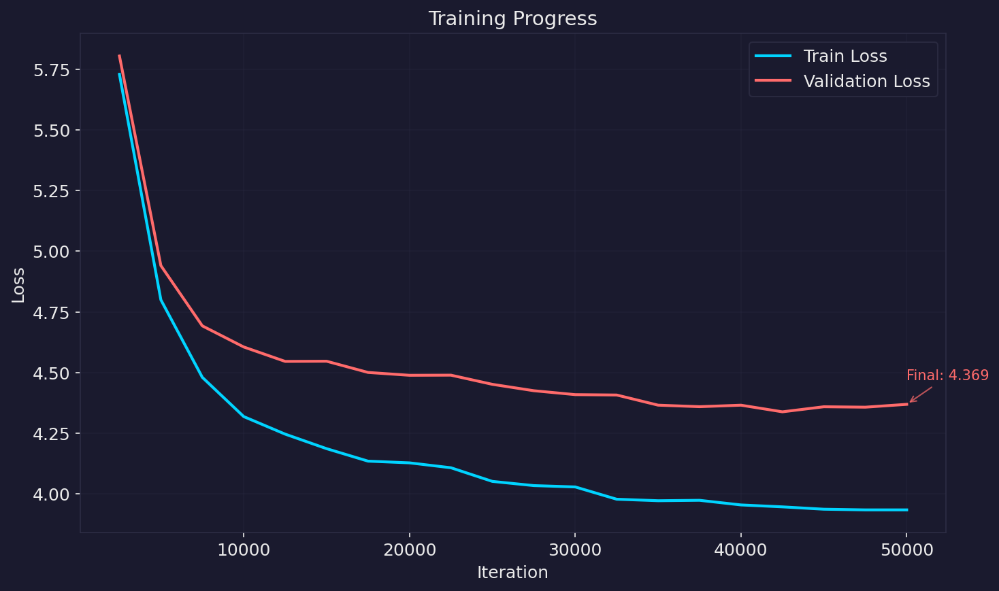
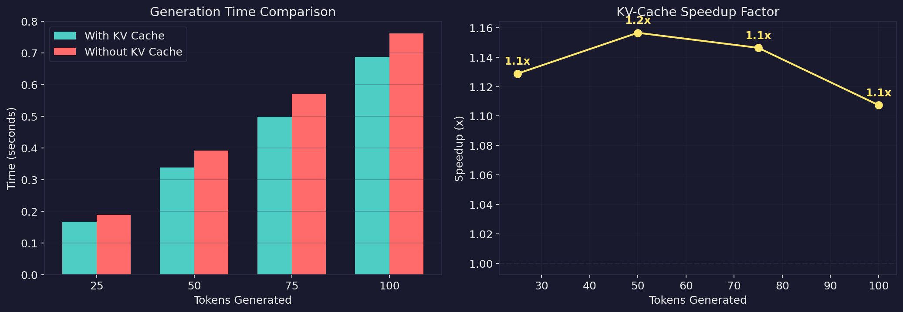

# Transformer from Scratch


A 30M parameter GPT-style decoder-only transformer, built from scratch in PyTorch. Educational implementation in ~1000 lines of code, trained on [FineWeb-Edu](https://huggingface.co/datasets/HuggingFaceFW/fineweb-edu).

The code is plain and readable: `train.py` is a ~400-line training loop with gradient accumulation and mixed precision, `models/transformer.py` is a ~300-line model definition. That's it.

## Install

```bash
pip install torch numpy matplotlib requests tqdm datasets tiktoken
```

Dependencies:
- [pytorch](https://pytorch.org) for the model
- [tiktoken](https://github.com/openai/tiktoken) for OpenAI's fast BPE tokenizer
- [datasets](https://huggingface.co/docs/datasets) for FineWeb-Edu download

## Quick Start

**Train a model.** Downloads ~100MB of FineWeb-Edu data and trains for 50k iterations:

```bash
python train.py
```

This creates checkpoints in `outputs/checkpoints/`. On a Kaggle T4 GPU, training takes ~8.5 hours and reaches a validation loss of ~4.34.

**Generate text.** Once training is done:

```bash
python generate.py --prompt "Learning to read is one of the most"
```

Sample output:

```
Learning to read is one of the most important things to read.
- Reading is a skill that helps students learn.
- Reading can be a skill that helps them understand the language and how to read.
- Reading is a skill that can be used to read a book, and they can be used in writing.
- Reading is a skill that is used to teach and writing.
- Reading is a skill that can be used in the classroom.
```

Not bad for a 30M parameter model trained on 100MB of educational text.

## Reproducing Results

| | |
|---|---|
| Dataset | [FineWeb-Edu](https://huggingface.co/datasets/HuggingFaceFW/fineweb-edu) (100MB sample) |
| Hardware | Kaggle T4 GPU (16GB) |
| Training time | ~8.5 hours |
| Iterations | 50,000 |
| Best val loss | 4.34 |
| Tokens processed | ~1.6B |



The training uses cosine learning rate decay with warmup, gradient accumulation (effective batch size 128), and FP16 mixed precision.

## Model

| Parameter | Value |
|-----------|-------|
| Parameters | 30M |
| Layers | 6 |
| Attention heads | 4 |
| Embedding dim | 256 |
| Context length | 256 |
| Vocab size | 50,304 |
| FFN hidden | 1,024 |

Architecture follows "Attention Is All You Need" with GPT-2 modifications:
- **Pre-LayerNorm**: LayerNorm before attention/FFN (more stable training)
- **Sinusoidal positional encoding**: Classic fixed positional embeddings
- **GELU activation**: In feed-forward layers
- **Weight tying**: Embedding and output projection share weights
- **KV-Cache**: Efficient autoregressive generation

## Generation

```bash
python generate.py --checkpoint outputs/checkpoints/checkpoint_best.pt \
                   --prompt "Hello world" \
                   --max-tokens 100 \
                   --temperature 0.8 \
                   --top-k 50
```

| Argument | Default | Description |
|----------|---------|-------------|
| `--checkpoint` | `checkpoint_best.pt` | Model checkpoint path |
| `--prompt` | `""` | Starting text |
| `--max-tokens` | 200 | Tokens to generate |
| `--temperature` | 0.8 | Sampling temperature |
| `--top-k` | 50 | Top-k sampling (0 = disabled) |
| `--no-cache` | - | Disable KV-cache |
| `--compare-speed` | - | Benchmark cache vs no-cache |

The KV-cache provides significant speedup for generation:



## Visualization

Generate all plots:

```bash
python visualize.py --all
```

Or individual plots:

```bash
python visualize.py --plot training_curves
python visualize.py --plot attention_heatmap
python visualize.py --plot embeddings
python visualize.py --plot kv_cache_speedup
```

## File Structure

```
├── train.py                 # Training loop (~400 lines)
├── generate.py              # Text generation with KV-cache
├── tokenizer.py             # tiktoken BPE wrapper
├── visualize.py             # Visualization tools
├── models/
│   ├── transformer.py       # Full model (~300 lines)
│   ├── multi_head_attention.py
│   ├── self_attention.py
│   └── kv_cache.py
├── data/                    # Downloaded data (gitignored)
└── outputs/                 # Checkpoints and logs (gitignored)
```

## References

- [Attention Is All You Need](https://arxiv.org/abs/1706.03762) - Original transformer paper
- [Language Models are Unsupervised Multitask Learners](https://cdn.openai.com/better-language-models/language_models_are_unsupervised_multitask_learners.pdf) - GPT-2 paper (pre-norm, GELU)
- [nanoGPT](https://github.com/karpathy/nanoGPT) - Karpathy's training loop reference
- [tiktoken](https://github.com/openai/tiktoken) - OpenAI's BPE tokenizer

## License

MIT
